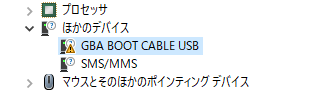
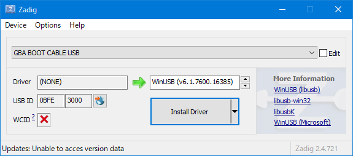
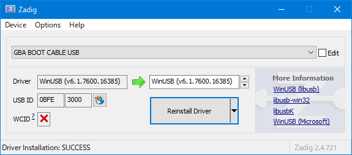
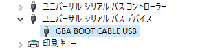

# optusbx

Windows用に移植した[optusb](http://www.skyfree.org/jpn/unixuser/optusb.html)  
少しコード（main関数）を書けば他のプラットフォームでも動くはず  
また、新しい[libusb](https://libusb.info/)（1.0.22）を使用しているので、他のプラットフォームでも恩恵はありそう  

## なんで

WindowsでRAMに転送したかった  
ブートケーブルUSBは元々[ITプラザ](http://www.itplaza.co.jp/opti/bootcable/btusb.html)が開発していて、ドライバやコントロールソフトウェアもWindows用のものが存在する模様だが、どうやらx64版が用意されていないようなので  
~~本当は移植が完了してから存在に気づいたけど、結局使用できなかった~~  

## 本家との違い

本家のライセンスが分からないので、1から書き直した  
新しいlibusb（1.0.22）を使用しているのと、C++で書いたのが主な変更点  

## 使い方

### 準備

optusbxはlibusbを使用しているので、libusbがデバイスを使用できるようドライバをインストールする必要がある  
ドライバのインストール方法は[libusbのWiki](https://github.com/libusb/libusb/wiki/Windows#How_to_use_libusb_on_Windows)に書いてあるが、ここにも記しておく

最初に、ブートケーブルをコンピュータに接続しておく  
このとき、GBAは繋いでいてもいなくても良い  
なるべくUSB2.0のポートで接続する（環境によってはUSB3.0以上のポートで認識しないことがある）  
接続が完了したら、デバイスマネージャーで以下の様に表示されるはず  
  

次に、ドライバをインストールする  
[Zadigの公式サイト](https://zadig.akeo.ie/)のDownloadから、最新版のZadigをダウンロードして実行する  
起動すると、UACの許可を求められた後、以下の画面が表示される  
  
USB IDが**0BFE 3000**であることと、Driverの矢印の右側が**WinUSB**になっていることを確認し、Install Driverボタンを押す  

ドライバのインストールに成功すると、以下の様な画面になる  
  
デバイスマネージャーでは、以下の様な表示になる  
  

以上でoptusbxを使用する準備が整う  

### 実行

[本リポジトリのReleases](https://github.com/SegaraRai/optusbx/releases)から最新版のoptusbx.zipをダウンロードし、適当なディレクトリに解凍する  

アーカイブのx86ディレクトリ内のものは32ビットOS用で、x64ディレクトリ内のものは64ビットOS用なので、適当な方のディレクトリにあるoptusbx.exeを実行する  
（なお、64ビットOSならば32ビットOS用のプログラムも使用できる）  

使用方法は本家optusbと変わらない  
GBAが白い画面になった後、第一引数にプログラムファイルを指定して実行すれば良い  

転送に成功すると、何も出力せずに終了する  
エラーが発生すると、通常何らかのメッセージが出力される  
